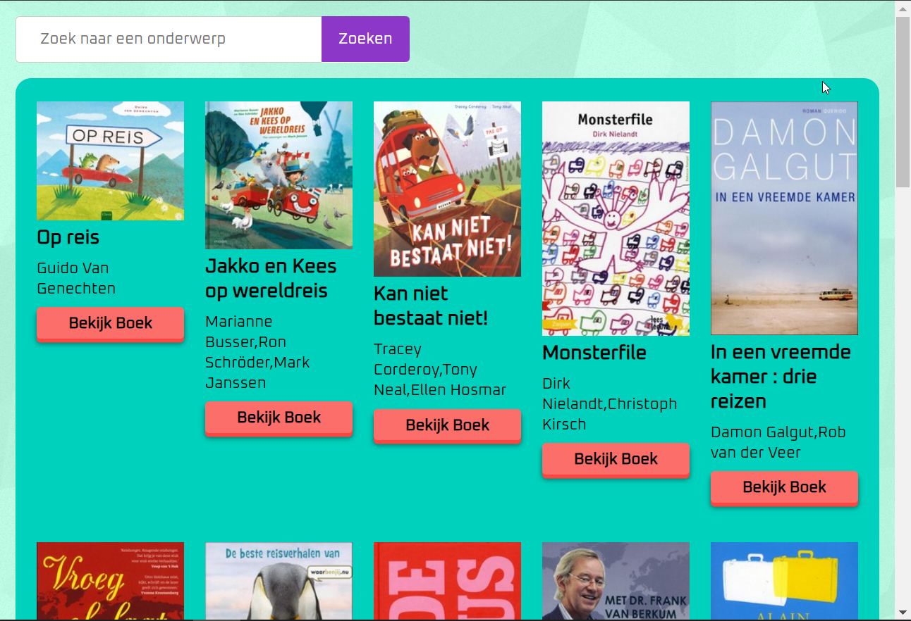

# Spreekbeurt helper
Gemaakt door: Tabish Nanhekhan & Mees Sour

## Demo
https://tnanhekhan.github.io/project-1-1920/

## Summary
Een app bedoeld voor kinderen op de basisschool van groep 4 – groep 8, om ze te helpen met het vinden van een onderwerp voor een spreekbeurt. De app is zo gemaakt dat er stap voor stap iets gevraagd wordt en dat alles er gebruikersvriendelijk uit ziet, ideaal voor deze doelgroep.

## Showcase

